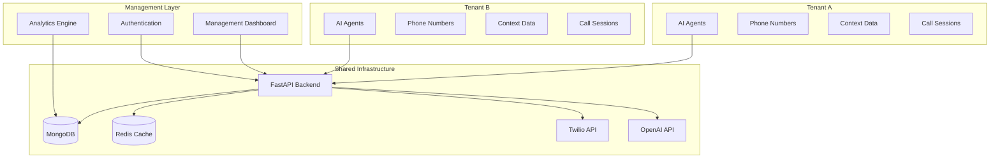

# 👥 Multi-Tenant Architecture

Phony's multi-tenant architecture enables organizations to deploy, manage, and scale multiple AI agents across different departments, clients, or business units while maintaining complete data isolation and security.

## 🏗️ Architecture Overview

### System Design


## 🔐 Tenant Isolation

### Database-Level Separation
- **Document-based isolation**: Each tenant's data stored in separate MongoDB collections
- **Index optimization**: Tenant-specific indexes for optimal performance
- **Query filtering**: Automatic tenant context in all database operations
- **Backup isolation**: Separate backup and restore procedures per tenant

### API-Level Security
- **Tenant authentication**: JWT tokens with tenant context
- **Request validation**: Automatic tenant verification on all endpoints
- **Rate limiting**: Per-tenant API quotas and throttling
- **Access control**: Role-based permissions within tenant scope

### Resource Isolation
```python
# Example tenant context in API requests
{
    "tenant_id": "acme_corp_uuid",
    "user_id": "user_123",
    "roles": ["agent_manager", "supervisor"],
    "permissions": [
        "agents.create",
        "agents.read", 
        "agents.update",
        "calls.monitor",
        "calls.override"
    ]
}
```

## 🏢 Agent Deployment System

### Complete Implementation
The agent deployment system provides:

1. **Visual Agent Management**: Browser-based agent creation and configuration
2. **Phone Number Assignment**: Twilio integration with automatic number sync
3. **Real-time Context Updates**: Live agent behavior modification during calls
4. **Call Analytics**: Per-agent and per-tenant performance metrics
5. **Role-Based Access Control**: Granular permission management

### Agent Types & Configuration

#### Inbound Agents
- **One-to-one phone mapping**: Each phone number assigned to maximum one inbound agent
- **Automatic call routing**: Incoming calls routed to correct agent based on number
- **Context inheritance**: Tenant-specific business context automatically included
- **Performance tracking**: Call volume, duration, and success metrics

#### Outbound Agents  
- **Flexible usage**: Multiple agents can make outbound calls
- **Context injection**: Dynamic context for each outbound call
- **Scenario-based calling**: Pre-configured calling scenarios
- **Consent management**: Built-in consent tracking and validation

#### Hybrid Configuration
```python
{
    "agent_id": "agent_uuid",
    "tenant_id": "tenant_uuid",
    "name": "Customer Service Agent",
    "type": "inbound",
    "phone_numbers": ["+18578167225"],
    "system_prompt": "You are a customer service representative for {company_name}...",
    "voice": "alloy",
    "context_data": {
        "company_name": "Acme Corp",
        "business_hours": "9 AM - 6 PM EST",
        "support_email": "support@acme.com",
        "department": "customer_service",
        "escalation_rules": {
            "keywords": ["complaint", "manager", "cancel"],
            "target": "+15551234567"
        }
    },
    "statistics": {
        "total_calls": 245,
        "total_minutes": 980,
        "average_duration": 240,
        "success_rate": 0.94
    }
}
```

## 📱 Phone Number Management

### Automatic Twilio Integration
```python
# Phone number synchronization
{
    "phone_number": "+18578167225",
    "twilio_sid": "PN1234567890abcdef",
    "friendly_name": "Customer Service Line",
    "capabilities": ["voice", "sms"],
    "status": "assigned",
    "assigned_agent": "agent_uuid",
    "tenant_id": "tenant_uuid",
    "webhook_urls": {
        "voice": "https://domain.com/receive_call",
        "status": "https://domain.com/call_status"
    }
}
```

### Number Assignment Features
- **Visual management interface**: Drag-and-drop assignment
- **Availability tracking**: Real-time status of all numbers
- **Automatic webhook configuration**: Twilio webhooks set automatically
- **Conflict prevention**: One number per inbound agent enforcement
- **Batch operations**: Assign multiple numbers efficiently

## 🎛️ Management Dashboard

### Web-Based Agent Management
The complete browser-based interface includes:

#### Agent Cards View
```html
<!-- Visual agent representation -->
<div class="agent-card">
    <h3>Customer Service Agent</h3>
    <div class="agent-stats">
        <span>📞 245 calls</span>
        <span>⏱️ 980 minutes</span>
        <span>📊 94% success</span>
    </div>
    <div class="phone-numbers">
        <span class="phone-assigned">+1 (857) 816-7225</span>
    </div>
    <div class="agent-actions">
        <button onclick="editAgent()">Edit</button>
        <button onclick="viewAnalytics()">Analytics</button>
    </div>
</div>
```

#### Real-Time Context Editor
- **Live updates**: Modify agent context during active calls
- **JSON editor**: Structured data editing with validation
- **Template system**: Pre-configured context templates
- **Version history**: Track context changes over time

#### Phone Number Assignment Interface
- **Available numbers grid**: Visual representation of all Twilio numbers
- **Assignment status**: Clear indication of assigned/available state
- **Drag-and-drop**: Intuitive number assignment
- **Bulk operations**: Manage multiple assignments simultaneously

## 🗄️ Database Architecture

### MongoDB Document Structure
```javascript
// Agents Collection
{
    "_id": ObjectId("..."),
    "tenant_id": "tenant_uuid",
    "name": "Support Agent",
    "type": "inbound",
    "phone_numbers": ["+18578167225"],
    "system_prompt": "...",
    "voice": "alloy",
    "context_data": { /* tenant-specific context */ },
    "is_active": true,
    "created_at": ISODate("..."),
    "updated_at": ISODate("..."),
    "statistics": {
        "total_calls": 123,
        "total_minutes": 456,
        "last_call": ISODate("...")
    }
}

// Call Sessions Collection
{
    "_id": ObjectId("..."),
    "tenant_id": "tenant_uuid", 
    "agent_id": "agent_uuid",
    "call_sid": "CA1234567890abcdef",
    "from_number": "+15559999999",
    "to_number": "+18578167225",
    "direction": "inbound",
    "status": "completed",
    "started_at": ISODate("..."),
    "ended_at": ISODate("..."),
    "duration_seconds": 240,
    "context": { /* call-specific context */ },
    "transcript": [ /* conversation transcript */ ],
    "cost": 0.052
}

// Context Updates Collection
{
    "_id": ObjectId("..."),
    "tenant_id": "tenant_uuid",
    "agent_id": "agent_uuid", 
    "call_sid": "CA1234567890abcdef",
    "context_data": { /* updated context */ },
    "updated_by": "user_uuid",
    "updated_at": ISODate("..."),
    "reason": "Customer escalation"
}
```

### Indexing Strategy
```javascript
// Optimized indexes for multi-tenancy
db.agents.createIndex({ "tenant_id": 1, "is_active": 1 })
db.agents.createIndex({ "tenant_id": 1, "phone_numbers": 1 })
db.call_sessions.createIndex({ "tenant_id": 1, "started_at": -1 })
db.call_sessions.createIndex({ "tenant_id": 1, "agent_id": 1 })
db.context_updates.createIndex({ "tenant_id": 1, "call_sid": 1 })
```

## 🔄 Real-Time Features

### Live Context Updates
During active calls, supervisors can update agent context in real-time:

```python
# Context update API
PUT /api/calls/{call_sid}/context
{
    "context": {
        "customer_priority": "high",
        "previous_interactions": 3,
        "notes": "Customer reported billing discrepancy",
        "resolution_deadline": "2024-01-15T17:00:00Z",
        "escalation_approved": true
    }
}
```

### WebSocket Event Streams
```javascript
// Real-time event streaming per tenant
const ws = new WebSocket(`wss://api.domain.com/events/ws?tenant_id=${tenantId}`);

ws.onmessage = (event) => {
    const data = JSON.parse(event.data);
    
    switch(data.event_type) {
        case 'agent.created':
            updateAgentsList(data.agent);
            break;
        case 'call.started':
            addActiveCall(data.call_session);
            break;
        case 'context.updated':
            refreshAgentContext(data.agent_id, data.context);
            break;
        case 'call.ended':
            updateCallStatistics(data.call_session);
            break;
    }
};
```

## 📊 Analytics & Reporting

### Tenant-Level Analytics
```python
{
    "tenant_id": "acme_corp_uuid",
    "period": {
        "start": "2024-01-01T00:00:00Z",
        "end": "2024-01-31T23:59:59Z"
    },
    "summary": {
        "total_agents": 8,
        "active_agents": 6,
        "total_calls": 1250,
        "total_minutes": 4800,
        "average_call_duration": 230,
        "success_rate": 0.92,
        "cost": 1250.75
    },
    "agent_performance": [
        {
            "agent_id": "agent_123",
            "name": "Customer Support",
            "calls": 350,
            "minutes": 1400,
            "success_rate": 0.94
        }
    ],
    "hourly_distribution": {
        "9": 45, "10": 78, "11": 92, "12": 65,
        "13": 85, "14": 110, "15": 98, "16": 77
    }
}
```

### Cross-Tenant Comparison (Admin View)
```python
{
    "comparison_period": "2024-01",
    "tenants": [
        {
            "tenant_id": "acme_corp",
            "name": "Acme Corporation",
            "agents": 8,
            "calls": 1250,
            "success_rate": 0.92,
            "cost": 1250.75
        },
        {
            "tenant_id": "beta_company",
            "name": "Beta Company", 
            "agents": 3,
            "calls": 450,
            "success_rate": 0.89,
            "cost": 425.50
        }
    ],
    "system_totals": {
        "total_tenants": 12,
        "total_agents": 45,
        "total_calls": 5200,
        "system_uptime": 0.9995
    }
}
```

## 🔧 Development Features

### Async Architecture
All database operations use async/await for optimal performance:

```python
from motor.motor_asyncio import AsyncIOMotorClient
from pydantic import BaseModel
from typing import List, Optional

class AgentRepository:
    def __init__(self, client: AsyncIOMotorClient):
        self.db = client.phony
        self.agents = self.db.agents
    
    async def create_agent(self, tenant_id: str, agent_data: dict) -> dict:
        agent_doc = {
            **agent_data,
            "tenant_id": tenant_id,
            "created_at": datetime.utcnow(),
            "updated_at": datetime.utcnow()
        }
        result = await self.agents.insert_one(agent_doc)
        return await self.get_agent(tenant_id, str(result.inserted_id))
    
    async def list_agents(self, tenant_id: str, active_only: bool = True) -> List[dict]:
        query = {"tenant_id": tenant_id}
        if active_only:
            query["is_active"] = True
        
        cursor = self.agents.find(query).sort("created_at", -1)
        return await cursor.to_list(None)
    
    async def update_agent_context(self, tenant_id: str, agent_id: str, context: dict) -> bool:
        result = await self.agents.update_one(
            {"_id": ObjectId(agent_id), "tenant_id": tenant_id},
            {
                "$set": {
                    "context_data": context,
                    "updated_at": datetime.utcnow()
                }
            }
        )
        return result.modified_count > 0
```

### Type Safety with Pydantic
```python
from pydantic import BaseModel, validator
from typing import List, Optional, Dict, Any
from enum import Enum

class AgentType(str, Enum):
    INBOUND = "inbound"
    OUTBOUND = "outbound"
    HYBRID = "hybrid"

class VoiceType(str, Enum):
    ALLOY = "alloy"
    ECHO = "echo" 
    FABLE = "fable"
    ONYX = "onyx"
    NOVA = "nova"
    SHIMMER = "shimmer"

class Agent(BaseModel):
    id: Optional[str] = None
    tenant_id: str
    name: str
    type: AgentType
    phone_numbers: List[str] = []
    system_prompt: str
    voice: VoiceType = VoiceType.ALLOY
    greeting_message: Optional[str] = None
    context_data: Dict[str, Any] = {}
    is_active: bool = True
    max_call_duration: Optional[int] = 1800  # 30 minutes default
    
    @validator('phone_numbers')
    def validate_phone_numbers(cls, v):
        for number in v:
            if not number.startswith('+'):
                raise ValueError('Phone numbers must include country code')
        return v
    
    @validator('system_prompt')
    def validate_system_prompt(cls, v):
        if len(v.strip()) < 10:
            raise ValueError('System prompt must be at least 10 characters')
        return v.strip()

class CallSession(BaseModel):
    id: Optional[str] = None
    tenant_id: str
    agent_id: str
    call_sid: str
    from_number: str
    to_number: str
    direction: str  # "inbound" or "outbound"
    status: str
    started_at: datetime
    ended_at: Optional[datetime] = None
    duration_seconds: Optional[int] = None
    context: Dict[str, Any] = {}
    transcript: List[Dict[str, Any]] = []
    cost: Optional[float] = None
```

## 🚀 Deployment & Scaling

### Docker Configuration
```yaml
# docker-compose.yml with multi-tenancy
services:
  backend:
    build: .
    environment:
      - MONGODB_URL=mongodb://mongodb:27017
      - REDIS_URL=redis://redis:6379
      - MULTI_TENANT_MODE=true
    depends_on:
      - mongodb
      - redis
  
  mongodb:
    image: mongo:7
    environment:
      - MONGO_INITDB_DATABASE=phony
    volumes:
      - mongodb_data:/data/db
  
  redis:
    image: redis:alpine
    volumes:
      - redis_data:/data

volumes:
  mongodb_data:
  redis_data:
```

### Environment Configuration
```bash
# Multi-tenant specific settings
MULTI_TENANT_MODE=true
TENANT_ISOLATION_LEVEL=database  # database, schema, or cluster
DEFAULT_TENANT_LIMITS='{"agents": 10, "calls_per_hour": 1000}'
TENANT_ONBOARDING_AUTO=true
CROSS_TENANT_ANALYTICS=false

# MongoDB settings
MONGODB_URL=mongodb://localhost:27017
MONGODB_DATABASE=phony
MONGODB_POOL_SIZE=50
MONGODB_MAX_IDLE_TIME=30

# Redis settings for session management
REDIS_URL=redis://localhost:6379
REDIS_KEY_PREFIX=phony:tenant:
REDIS_SESSION_TTL=3600
```

## 🔒 Security Considerations

### Authentication & Authorization
- **JWT tokens**: Tenant context embedded in tokens
- **Role-based access**: Granular permissions per tenant
- **API key management**: Tenant-specific API keys
- **Session isolation**: Redis sessions with tenant prefixes

### Data Protection
- **Encryption at rest**: MongoDB encryption enabled
- **Encryption in transit**: TLS 1.3 for all connections
- **PII handling**: Automatic redaction and anonymization
- **Audit logging**: Complete audit trail per tenant

### Compliance Features
- **GDPR compliance**: Data portability and deletion
- **HIPAA considerations**: Healthcare data handling
- **SOC 2 preparation**: Security control framework
- **Tenant data isolation**: Complete separation guarantees

## 💡 Best Practices

### Tenant Onboarding
1. **Initial setup**: Create tenant with default configuration
2. **Agent creation**: Start with one inbound agent
3. **Phone assignment**: Assign primary business number
4. **Testing**: Verify inbound call routing
5. **Training**: Provide dashboard training and documentation

### Performance Optimization
- **Database indexing**: Tenant-aware indexes for all queries
- **Connection pooling**: Efficient database connection management
- **Caching strategy**: Redis caching with tenant isolation
- **Resource limits**: Per-tenant quotas and throttling

### Monitoring & Maintenance
- **Health checks**: Per-tenant system health monitoring
- **Performance metrics**: Tenant-specific performance tracking
- **Automated backups**: Tenant data backup and restore procedures
- **Update procedures**: Zero-downtime updates with tenant isolation

---

*Next: {doc}`docker-deployment` - Complete deployment guide*